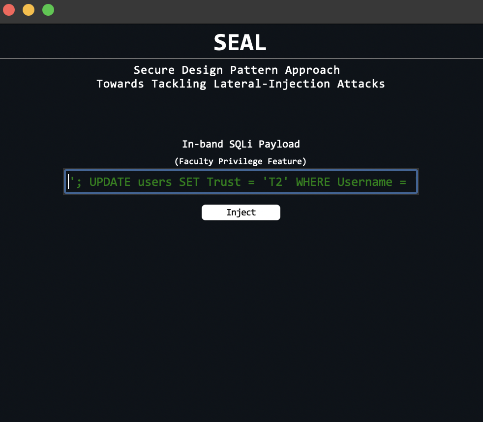
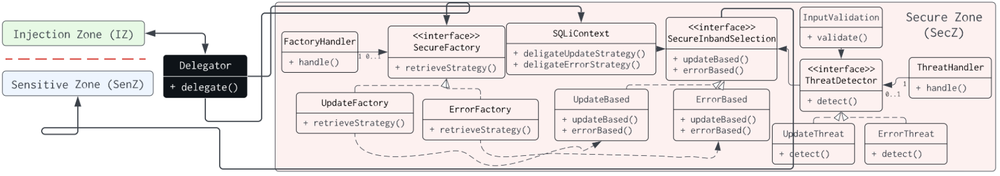

<h3 align = "center"> SEAL: A Secure Design Pattern Approach Toward Tackling Lateral-Injection Attacks </h3>

---

<p align = "center">  </p>

<h2 align = "center"> Core Design </h2>
<p align="center">  </p>

---

Official Implementation of [A Secure Design Pattern Approach Toward Tackling Lateral-Injection Attacks](https://ieeexplore.ieee.org/abstract/document/9970499?casa_token=BjtPFw68X8gAAAAA:VhCDlpIlkp9v-UIPp2zD5634iVo-mI12sQTo_ZTUb_tX1JaSPn56GXnN2aE9DQ12vmUBF2AktQ). The 15th IEEE International Conference on Security of Information and Networks (SIN'22).

Abstract
> Software weaknesses that create attack surfaces for adversarial exploits, such as lateral SQL injection (LSQLi) attacks, are usually introduced during the design phase of software development. Security design patterns are sometimes applied to tackle these weaknesses. However, due to the stealthy nature of lateral-based attacks, employing traditional security patterns to address these threats is insufficient. Hence, we present SEAL, a secure design that extrapolates architectural, design, and implementation abstraction levels to delegate security strategies toward tackling LSQLi attacks. We evaluated SEAL using case study software, where we assumed the role of an adversary and injected several attack vectors tasked with compromising the confidentiality and integrity of its database. Our evaluation of SEAL demonstrated its capacity to address LSQLi attacks.

<hr>
Artifact Author: Chidera Biringa
<hr>

Cite
```
@inproceedings{biringa2022secure,
  title={A Secure Design Pattern Approach Toward Tackling Lateral-Injection Attacks},
  author={Biringa, Chidera and Kul, G{\"o}khan},
  booktitle={2022 15th International Conference on Security of Information and Networks (SIN)},
  pages={01--04},
  year={2022},
  organization={IEEE}
}
```

Ethical Considerations
> Lateral-Injection attack strategies employed in this work are strictly for research purposes.

Installation
```
$ git clone https://github.com/biringaChi/SEAL
```

Running **SEAL**
```
$ cd src
$ python main.py
```
Cases: Enter *input* below in the *entry field* and click *inject*

Case 1
```
User1
``` 

Case 2
```
User2
``` 

Case 3
```
'; UPDATE users SET Trust = 'T2' WHERE Username = 'User1'; SELECT 1; --
``` 

Case 4
```
User3
``` 

LICENSE:
[MIT LICENSE](./LICENSE)